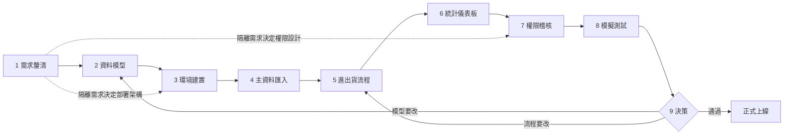

# 以 InvenTree 為基礎的動態庫存掌握系統：設計流程

> 狀態：草案 v0.3（已查證 v0.1 的兩個待確認點，見 §4）
> **已定案（2026-10-09）**：採**單站部署**。各公司可看到彼此庫存，但**只有該公司的使用者能修改自己公司的庫存**（擁有權控制，擁有者＝公司群組）。
> 目標版本：✅ **InvenTree 1.5.6**（2026-10 查得最新正式版，已定案）。本機安裝見 `inventree-install/README.md`。
> 欄位名稱與 API 以官方文件為準，本文已查證的部分標 ✅，仍需在測試站實測的標 🧪。

## 1. 目標與範圍

**目標**：掌握三間子公司各自的即時庫存、進貨、出貨數字，並能依「公司 → 產品 → 樣式 → 尺寸」逐層下鑽與彙總。

**規模假設**

| 層級 | 數量 | 說明 |
|---|---|---|
| 子公司 | 3 | A / B / C |
| 產品 | 10 / 公司 | 共 30 個（假設各公司產品不同；若相同見 §3 步驟 2.3） |
| 樣式 | 5 / 產品 | 例：顏色或花色 |
| 尺寸 | 3 / 樣式 | XL / L / M |
| **SKU 總數** | 3 × 10 × 5 × 3 = **450** | 最小庫存單位 |

**不在本期範圍**：會計總帳、薪資、電商前台。

## 2. 流程總覽與步驟銜接



### 2.1 步驟之間的交接（前一步的產出 = 下一步的輸入）

| 交接 | 交接物 | 若缺少會怎樣 |
|---|---|---|
| 1 → 2 | 需求確認表（8 題答案） | 無法決定產品是否共用、要不要分站 |
| 1 → 3 | 「是否需要互相看不到庫存」的答案 | **決定單站或多站部署**（見 §4.2），之後很難改 |
| 2 → 3 | 庫位樹、分類樹、參數模板清單 | 建站後不知道要先設定什麼 |
| 2 → 4 | 資料字典 + 料號規則 | 生成腳本無規則可依 |
| 3 → 4 | 測試站 URL + API token | 腳本無法執行 |
| 4 → 5 | 450 個 SKU 已建好且有最小庫存量 | 無法開採購單／銷售單 |
| 5 → 6 | 進出貨 SOP + 「統計口徑」定義 | 儀表板數字與現場對不起來 |
| 6 → 8 | 儀表板 + 查詢清單 | 無法做正確性比對 |
| 7 → 8 | 權限矩陣 + 各角色測試帳號 | 無法測權限 |
| 8 → 9 | 測試報告 + 使用者回饋 | 無法做決策 |

### 2.2 全程固定不變的約定（每一步都要遵守）

- **料號規則**：`{公司}-{產品}-{樣式}-{尺寸}`，例 `A-P03-S2-XL`，存在 IPN 欄位。
- **庫存歸屬一律以庫位為準**，不以料號判斷屬於哪間公司。
- **統計口徑**：進貨＝採購單收貨入庫時點；出貨＝銷售單出貨（shipment 完成）時點；調撥不計入進出貨，只計庫位間移動。
- **所有異動都要經由系統操作**（UI 或 API），禁止直接改資料庫，否則異動紀錄會缺漏。

## 3. 步驟詳解

### 步驟 1：需求釐清

要先回答的問題：

1. 三間子公司是否**共用同一批產品**？
2. 子公司之間會不會**互相調撥**庫存？
3. 子公司之間是否必須**互相看不到對方庫存**？（⚠️ 影響最大，見 §4.2）
   → ✅ **已答**：不需要隱藏，只需「只有自家使用者能修改」。採單站 + 擁有權控制。
4. 每間公司有幾個實體倉庫或庫位？
5. 「進貨」來源：供應商採購？總公司調入？自家生產？
6. 「出貨」對象：客戶訂單？調撥給別間公司？
7. 需要哪些統計：日／週／月進出貨量、週轉率、低庫存、呆滯品？
8. 使用人數、同時在線人數（決定主機規格）。

**產出物**：需求確認表。
**驗收**：8 題都有答案，且第 3 題已決定「單站」或「多站」。

### 步驟 2：資料模型設計

#### 2.1 對應 InvenTree 概念

| 業務概念 | InvenTree 對應 | 查證 |
|---|---|---|
| 子公司 | 頂層庫位（Stock Location），下設倉庫／庫位 | ✅ |
| 產品 | 零件模板（Part，開啟 Template 選項） | ✅ |
| 樣式 × 尺寸 | 模板底下的**變體**（Variant），每個變體帶 `Style`、`Size` 兩個**參數** | ✅ 變體／參數皆為正式功能 |
| 庫存數量 | 庫存項目（Stock Item），一個 SKU 在一個庫位一筆 | ✅ |
| 進貨 | 採購單（Purchase Order），收貨即入庫 | ✅ |
| 出貨 | 銷售單（Sales Order）→ 出貨單（Shipment）→ 分配 → 出貨 | ✅ 必須先建 shipment 才能分配 |
| 低庫存 | 零件的最小庫存量（minimum stock）+ 通知訂閱 | ✅ |

#### 2.2 變體結構：採「單層變體 + 參數」

```
產品模板 P03（Template）
├── A-P03-S1-XL  （參數 Style=S1, Size=XL）
├── A-P03-S1-L
├── ...          （共 15 個變體）
└── A-P03-S5-M
```

- 不採「模板 → 樣式模板 → 尺寸變體」三層結構。理由見 §4.1：多層技術上可行，但會讓部分統計數字漏算。
- 樣式層級的彙總改用**參數篩選**（官方「參數表格」支援多參數篩選）或 BI 依參數分組。
- `Style`、`Size` 參數模板設定 **Choices**（例 Size：`XL,L,M`），避免打錯字造成統計分裂。
- 樣式名稱若很多，改用 **Selection List**。

#### 2.3 跨公司共用 vs. 各自獨立

- **產品不同**（本文假設）：30 個模板、450 個變體，分類樹為 `公司 > 產品類別`。
- **產品相同**：10 個模板、150 個變體，料號去掉公司代碼；三間公司的差別全由庫位區分。
- 若步驟 1 決定「多站部署」（§4.2），則每站各自只有自己的 10 個模板、150 個變體。

**產出物**：資料字典（欄位、料號規則、分類樹、庫位樹、參數模板與選項）。
**驗收**：隨機 3 個 SKU 能唯一定位「公司／產品／樣式／尺寸／庫位」；Style/Size 選項表已定稿。

### 步驟 3：環境建置

- **部署架構**：✅ 已定案為**單站**（一個 InvenTree 管三間公司），用擁有權控制限制修改。
  （若日後改成「必須看不到別家庫存」，才需要改成三站，見 §5 風險。）
- Docker Compose 部署，資料庫用 PostgreSQL，先建**測試站**。
- 鎖定 **1.5.6**（安裝腳本已固定此版本）；升級前先讀 release notes（2026 年有安全性修補版，例如 1.2.7）。
- 每日備份資料庫與媒體檔，並實際演練一次還原。

**產出物**：測試站、備份腳本、API token（給步驟 4 用）。
**驗收**：能建零件並入庫；還原演練成功。

### 步驟 4：主資料匯入（450 SKU）

建立順序（有相依性，不可顛倒）：

1. 庫位樹（公司 → 倉庫 → 庫位）
2. 零件分類樹
3. 參數模板 `Style`、`Size`（含 Choices）
4. 產品模板（30 個，開啟 Template）
5. 變體（450 個，設定 `variant_of` 指向模板、IPN、最小庫存量）
6. 每個變體寫入 `Style`、`Size` 參數值
7. （選用）期初庫存

注意事項：

- 分類參數模板的「預設值」會讓分類內每個零件都拿到**同一個值**，不適合 Style/Size。這兩個參數要由腳本**逐一寫入**。✅
- 腳本必須**可重複執行**：以 IPN 查詢，已存在就略過或更新，不重複建立。
- 可用官方 Python API 套件或直接呼叫 REST API；`variant_of` 是 Part API 的正式欄位與篩選條件。✅

**實作**：✅ 已完成 `inventree-seed/seed_skus.py`（用法見 `inventree-seed/README.md`）。先用 `--dry-run` 產出 450 筆計畫 CSV 核對，再寫入測試站。腳本同時建立公司頂層庫位並把擁有者設為公司群組（銜接步驟 7）。

**產出物**：`inventree-seed/` 腳本與匯入紀錄。
**驗收**：零件數＝30 模板＋450 變體；抽查 20 個的 IPN、參數、模板關係皆正確。

### 步驟 5：進出貨流程設定

| 流程 | InvenTree 操作 | 要點 |
|---|---|---|
| 進貨 | 採購單 → 收貨 | 收貨即轉為庫存項目；庫位以「明細行庫位」優先，其次「訂單目的地」；收滿自動完成訂單 ✅ |
| 出貨 | 銷售單 → 建出貨單 → 分配庫存 → 出貨 | 分配時要選出貨單；一張銷售單可分多次出貨 ✅ |
| 同公司調撥 | 庫存轉移 | 不計入進出貨 |
| 跨公司調撥 | 見下 | 依步驟 1 第 2 題 |
| 盤點修正 | 庫存計數／調整 | 要求填寫原因 |

**跨公司調撥**

- 單站：A 開銷售單給「B 公司」（建為客戶），B 開採購單向「A 公司」（建為供應商）。進出貨數字自然正確，對帳清楚。
- 多站：同上，但兩站各自操作；可寫小腳本自動在對方站建立對應單據。

**低庫存通知**：設定最小庫存量後，低於門檻會通知**有訂閱該零件或分類**的使用者 ✅。所以每間公司的倉管要訂閱自己公司的分類。🧪 曾有使用者回報 email 未寄出，需在測試站實測通知管道。

**產出物**：各流程 SOP（含截圖）。
**驗收**：走完「進貨 → 調撥 → 出貨 → 盤點」一輪，數字與預期一致；低庫存通知實際收到。

### 步驟 6：統計與儀表板

**指標**

- 即時庫存：公司／產品／樣式／尺寸四層彙總
- 期間進貨量、出貨量、淨變動（日／週／月）
- 低庫存、零庫存清單
- 週轉率、呆滯品（N 天無異動）

**方案（由簡到繁）**

1. **內建**：零件清單、參數表格篩選、庫存異動紀錄。適合日常查詢。
2. **外部 BI（建議）**：Metabase 或 Grafana，以唯讀帳號連 PostgreSQL。以 IPN 前綴分公司／產品，以參數分樣式／尺寸。
3. **API 彙總**：多站部署時，由排程腳本從三站 API 拉資料，寫入彙總資料庫，再給 BI 用。

**已知限制**（見 §4.1）：模板頁面的庫存歷史圖、「訂購中」數量**不含變體**。因此產品層級的趨勢圖一律由 BI 做，不要依賴模板頁面。

**產出物**：儀表板、SQL／API 查詢清單、口徑說明（沿用 §2.2）。
**驗收**：抽 5 個 SKU 與 2 個產品，儀表板數字與後台手動加總一致。

### 步驟 7：權限與稽核

**角色**：倉管（可入出庫）、主管（看報表）、管理員（改主資料）。用使用者群組授權。

**公司隔離**（✅ 已定案：單站 + 擁有權控制）：

| 群組 | 擁有的頂層庫位 | 可修改 | 可查看 |
|---|---|---|---|
| `company-A` | A 公司（含子庫位與其庫存） | 只有 A | A、B、C |
| `company-B` | B 公司 | 只有 B | A、B、C |
| `company-C` | C 公司 | 只有 C | A、B、C |
| 管理員（superuser） | 全部 | 全部 | 全部 |

> 管理員帳號在 InvenTree 中視同擁有所有庫存，無法排除。日常作業請一律用一般帳號，管理員帳號只給系統維護者。

啟用順序（不可顛倒）：建群組並設權限 → 跑 seed 腳本設定庫位擁有者 → **最後**才開啟擁有權控制。

注意事項 ✅：

- 擁有權預設關閉，要在設定中開啟。
- 開啟後，**沒有擁有者的庫位與庫存項目，除管理員外沒人能改**。所以必須在匯入後、開始營運前設好擁有者。
- 設定庫位擁有者會一併套用到子庫位與該庫位的庫存項目。
- 擁有權不取代角色權限：使用者仍需在後台有庫存的寫入權限。

**稽核**：所有異動保留操作人與時間；API token 依用途分開。

**產出物**：權限矩陣、各角色測試帳號。
**驗收**：A 公司帳號可修改 A 的庫存、看得到但無法修改 B／C 的庫存。🧪 另需實測：新收貨入庫的庫存項目是否自動繼承庫位擁有者。

### 步驟 8：模擬測試與效果評估

**測試資料**：450 SKU 隨機期初庫存，再用腳本模擬 30 天的進貨、出貨、調撥，包含刻意的錯誤情境。

| 測試項目 | 做法 | 通過標準 |
|---|---|---|
| 正確性 | 腳本自行累計預期庫存，與系統比對 | 450 個 SKU 全部吻合 |
| 超賣防護 | 對庫存不足的 SKU 分配出貨 | 系統拒絕或明確警示 |
| 變體彙總 | 比對模板總庫存與 15 個變體加總 | 一致 |
| 效能 | 儀表板、清單篩選、批次匯入 | 事先訂定可接受秒數 |
| 低庫存 | 把數量降到最小庫存以下 | 訂閱者收到通知 |
| 權限隔離 | 用各公司帳號操作 | 符合權限矩陣 |
| 復原 | 刪測試資料後從備份還原 | 資料完整 |

**使用者問卷**：查一個 SKU 要多久？一次進貨幾步？儀表板有沒有回答每天的問題？還缺什麼？

**產出物**：測試報告與回饋彙整。

### 步驟 9：決策

| 結果 | 下一步 |
|---|---|
| 數字正確、使用者可接受 | 規劃正式上線與資料遷移 |
| 資料模型要改 | 回步驟 2，重跑 4–8（腳本可重複執行，成本低） |
| 流程要改 | 回步驟 5，重跑 6–8 |
| 缺的功能太多 | 評估外掛開發成本，或改用其他系統 |

## 3.1 使用者介面增強（已實作，見 `inventree-ui-helper/`）

| 需求 | 做法 | 狀態 |
|---|---|---|
| 中文介面 | InvenTree 內建繁體中文，在使用者設定切換語言 | ✅ 原生功能 |
| 滑鼠停留顯示操作說明 | Tampermonkey 瀏覽器腳本，比對按鈕文字顯示中文說明 | ✅ 模擬頁測試通過；🧪 待真機確認 |
| 調貨時跳出提醒小視窗 | 同一腳本：偵測「轉移庫存」視窗，即時顯示筆數與來源／目的公司，跨公司時警告 | ✅ 模擬頁測試通過；🧪 待真機確認 |
| 異動紀錄（時間、操作人） | InvenTree 原生已記錄；腳本提供集中查詢、篩選與匯出 CSV | ✅ 模擬頁測試通過；🧪 待真機確認 |
| 異常數量警告 | 送出前檢查：≥100 件、超過現有庫存、歸零 → 確認視窗。依 1.5.6 原始碼，伺服器端不擋超量（移除扣到 0、轉移整批搬走） | ✅ 自動測試；🧪 驗收清單 C |
| 快速調貨 | 面板內搜尋 SKU、依公司分色看庫存、呼叫 `/api/stock/transfer/`（帶 CSRF）；允許跨公司並提醒 | ✅ 自動測試；🧪 驗收清單 D |

選用瀏覽器腳本而非伺服器外掛的原因：InvenTree 外掛只能新增面板，無法替內建按鈕加提示；腳本不必修改 InvenTree 本體，升級不受影響。缺點是每台電腦要安裝一次。

## 3.2 多台電腦共用與 App 化（已實作，見 `inventree-app/`）

- **架構**：一台主機跑 InvenTree（Docker），其他電腦以瀏覽器連 `http://主機IP`，共用同一份資料。
- **App**：桌面捷徑以獨立視窗開啟 `/app/`；App 外框以同源 iframe 載入 InvenTree，並內建中文操作助手（不需 Tampermonkey）。
- **設定**：`INVENTREE_SITE_URL`、`INVENTREE_ALLOWED_HOSTS`、`INVENTREE_TRUSTED_ORIGINS` 含主機 IP 與 localhost；`INVENTREE_LANGUAGE=zh-hant`（語言選擇可能只存在各瀏覽器，故設系統預設）。依 1.5.6 原始碼核對：未列入的網址會出現 INVE-E7 錯誤。
- **不修改官方檔案**：以 `docker-compose.override.yml` 掛載自訂 `Caddyfile.app` 與 `app/`。
- **備份**：`backup.ps1` 匯出資料庫（pg_dump）＋上傳檔案＋設定檔為 zip。

## 4. 查證結果（v0.1 的兩個待確認點）

### 4.1 InvenTree 是否支援多層變體？

**結論：技術上可行，但本案不建議使用。**

- **支持可行的證據**
  - 官方 BOM 文件提到繼承的 BOM 項目會套用到「變體（或子變體）」，表示變體底下還能有變體。
  - 低庫存檢查的程式碼會「沿樹往上」檢查父零件。
  - 零件模型以 MPTT 樹管理變體家族（`tree_id`）。
  - 官方沒有寫明最大層數。
- **不建議的原因**
  - 社群討論指出：模板頁的**庫存歷史圖只顯示該零件本身**，不含變體；「訂購中」數量也不含變體；盤點清單 API 的變體處理也不一致。
  - 層數越多，這些落差越難追。
- **採用方案**：單層變體 + `Style`/`Size` 參數（§3 步驟 2.2）。官方確認「模板的庫存包含其下所有變體」，所以產品層總數正確；樣式層用參數篩選或 BI 分組。
- 🧪 仍建議在測試站建一組三層結構試一次，確認你的版本行為。

### 4.2 欄位、API 與權限能否支撐設計？

| 項目 | 結果 |
|---|---|
| `variant_of` | ✅ Part API 正式欄位，也可當篩選條件 |
| 參數模板 Choices／Selection List | ✅ 可限制 Style、Size 選項 |
| 分類參數預設值 | ✅ 存在，但所有零件拿同一值，不適合 Style/Size |
| 參數表格多重篩選 | ✅ 可依多個參數同時篩選 |
| 最小庫存與低庫存通知 | ✅ 需使用者訂閱零件或分類；🧪 email 寄送需實測 |
| 採購收貨入庫 | ✅ 收貨轉為庫存項目，收滿自動完成 |
| 銷售出貨 | ✅ 需先建出貨單再分配 |
| 擁有權控制 | ✅ 只**隱藏編輯按鈕**，**不隱藏檢視** → 影響步驟 3、7，已改寫 |

**對設計的影響**：v0.1 假設「用群組權限讓 A 看不到 B」不成立。已改為步驟 1 第 3 題決定單站或三站。

### 4.3 參考來源

- 零件模板與變體：https://docs.inventree.org/en/stable/part/template/
- 參數與參數表格：https://docs.inventree.org/en/stable/concepts/parameters/
- 擁有權控制：https://docs.inventree.org/en/stable/stock/owner/
- Part API 結構：https://docs.inventree.org/en/stable/api/schema/part/
- 變體統計限制的社群討論：https://github.com/inventree/InvenTree/discussions/9237
- MPTT 與變體家族：https://github.com/inventree/InvenTree/issues/12333
- 版本資訊：https://github.com/inventree/InvenTree/releases

## 5. 風險與注意事項

- **部署架構難以回頭**：單站改三站（或反之）要搬資料，所以步驟 1 第 3 題要先定案。
- **SKU 增長**：樣式或尺寸增加時，變體數倍增；料號規則與腳本要能擴充。
- **未設擁有者就開啟擁有權控制**：會導致一般使用者全部無法編輯。
- **升級風險**：自訂外掛與腳本受版本影響，先在測試站驗證。
- **統計口徑**：依 §2.2，所有報表都要用同一套定義。

## 6. 建議時程（粗估）

| 週次 | 內容 |
|---|---|
| 第 1 週 | 步驟 1–2 |
| 第 2 週 | 步驟 3–4 |
| 第 3 週 | 步驟 5–6 |
| 第 4 週 | 步驟 7–9 |

## 7. 下一步

1. 回答步驟 1 其餘 7 個問題（第 3 題已定案）。
2. 架設測試站（步驟 3），依 `inventree-seed/README.md` 執行主資料匯入（步驟 4）。
3. 可接著產出：30 天交易模擬腳本、儀表板 SQL。
