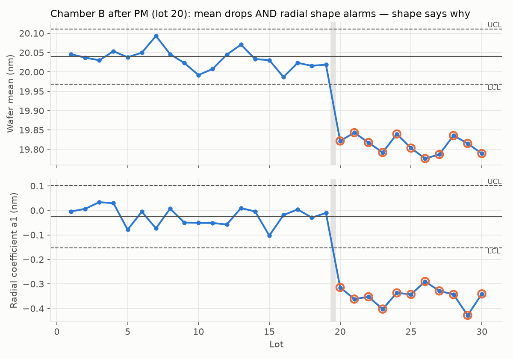
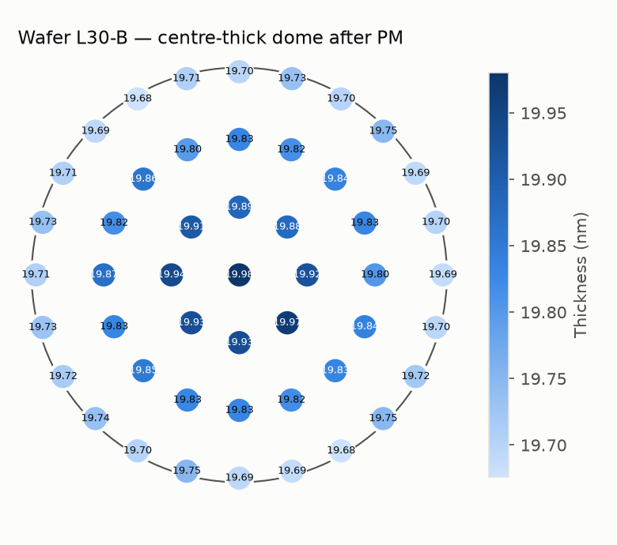
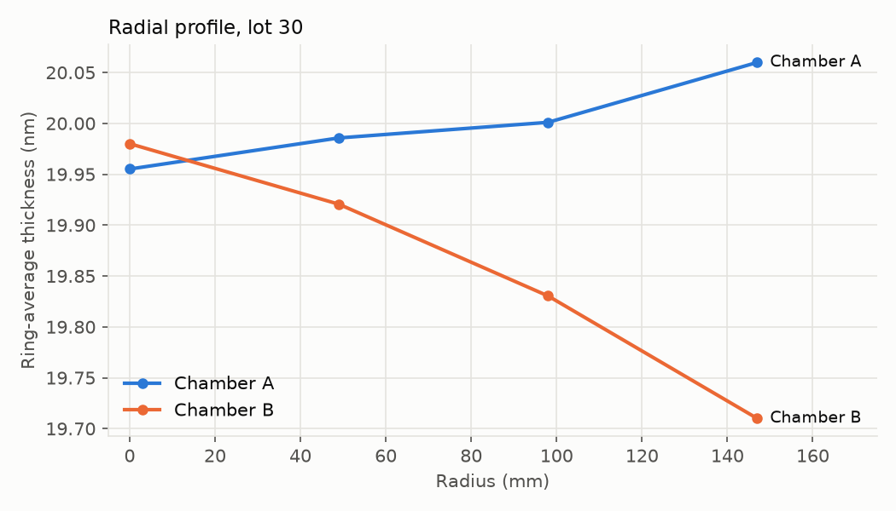

# 21 · Python / Data Analysis Toolkit

← [[20 Remote Fab Support]] · next → [[22 JMP SPC Workflow]]

Two tested files live in `code/`:

| File | Content |
|---|---|
| `code/metro_tools.py` | Library: statistics, uniformity, Cp/Cpk (+CI), run rules, EWMA, CUSUM, Gauge R&R ANOVA, paired bias, Deming regression, polar site maps, tilt/radial fits, Fresnel/transfer-matrix reflectance, Ψ/Δ, single-layer thickness fit, etch/CMP/ALD/Deal–Grove helpers. `python metro_tools.py` runs a self-test. |
| `code/example_wafer_analysis.py` | End-to-end worked example: synthetic 2-chamber × 30-lot × 49-site dataset → per-wafer summary → run rules → wafer map, control chart, radial profile (`code/out/`). |

Setup: `pip install numpy pandas scipy matplotlib`.

## Booklet snippets — verified outputs

```python
import numpy as np
data = np.array([20.01, 19.98, 20.04, 20.02, 20.07, 19.99])
mean, std = data.mean(), data.std(ddof=1)        # 20.0183, 0.0331
USL, LSL = 20.5, 19.5
cpk = min((USL-mean)/(3*std), (mean-LSL)/(3*std)) # 4.85  (95% CI ≈ 1.8–7.9 with n=6!)

tool_a = np.array([20.01, 20.03, 19.98, 20.02])
tool_b = np.array([20.08, 20.11, 20.06, 20.09])
bias = np.mean(tool_a - tool_b)                   # -0.075 nm

process_temp = np.array([300, 305, 310, 315, 320])
thickness    = np.array([19.4, 19.6, 19.9, 20.1, 20.4])
r = np.corrcoef(process_temp, thickness)[0, 1]    # 0.998
```

Note `ddof=1` — sample standard deviation. `np.std` defaults to `ddof=0` (population), a classic silent bug.

## Recipes you'll use weekly

### Load and enrich site data
```python
import pandas as pd, numpy as np
df = pd.read_csv("sites.csv", parse_dates=["metro_timestamp"])
df["r_mm"] = np.hypot(df.x_mm, df.y_mm)
df["theta_deg"] = np.degrees(np.arctan2(df.y_mm, df.x_mm)) % 360
df["ring"] = pd.cut(df.r_mm, [-1, 10, 60, 110, 150], labels=["C", "R1", "R2", "Edge"])
```

### Per-wafer summary (the table every SPC chart is built from)
```python
from metro_tools import radial_fit, uniformity
def summarize(g):
    coef, _ = radial_fit(g.x_mm.values, g.y_mm.values, g.thickness.values)
    return pd.Series(dict(mean=g.thickness.mean(), sigma=g.thickness.std(ddof=1),
                          unif=uniformity(g.thickness), radial_a1=coef[1]))
wafers = df.groupby(["lot_id", "wafer_id", "chamber_id"]).apply(summarize, include_groups=False).reset_index()
```

### Compare chambers / tools
```python
wafers.groupby("chamber_id")[["mean", "sigma", "radial_a1"]].agg(["mean", "std", "count"])
from scipy.stats import f_oneway
f_oneway(*[g["mean"] for _, g in wafers.groupby("chamber_id")])   # ANOVA
```

### Pivot to site-matched pre/post (etch, CMP)
```python
pre  = df[df.step == "pre"].set_index(["wafer_id", "site_id"]).thickness
post = df[df.step == "post"].set_index(["wafer_id", "site_id"]).thickness
removal = (pre - post).dropna()          # aligned by wafer AND site
```

### Robust outlier flag per wafer
```python
def robust_z(s):
    med = s.median(); mad = 1.4826 * (s - med).abs().median()
    return (s - med) / mad
df["rz"] = df.groupby("wafer_id").thickness.transform(robust_z)
outliers = df[df.rz.abs() > 4]
```

### Timeline overlay of events
```python
ax = wafers.plot(x="metro_timestamp", y="mean", marker="o")
for t in events.timestamp: ax.axvline(t, color="gray", lw=1)
```

## Worked example results (`example_wafer_analysis.py`)

Chamber B gets a dome after a PM before lot 20 (−0.35 nm·ρ²):

- Wafer-mean chart: R1/R4 and EWMA alarm from lot 20 (mean −0.2 nm).
- Radial coefficient a₁ chart: jumps from ~0 to ~−0.35 nm — **the shape tells you it is a spatial (gas/thermal/plasma) change, not a time/rate change**.
- Cpk over all 30 lots for chamber B: 1.35 — still "capable", which is exactly why capability alone is a poor excursion detector.





## Toward automation
1. Scheduled pull from the SPC/data warehouse → per-wafer summary table.
2. Rules: run rules on mean, σ, radial a₁, tilt c_x/c_y, GOF, n.
3. Auto-generate a one-page excursion report (maps + charts + IS/IS-NOT skeleton).
4. Keep thresholds and site maps in config, not code; version-control both.

Next: [[22 JMP SPC Workflow]].
