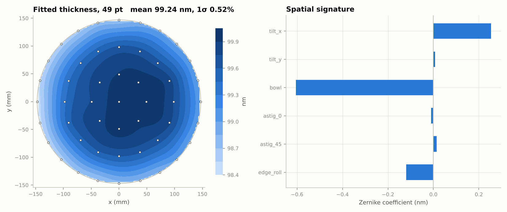

# metro-toolkit

A thin-film-first metrology analysis toolkit for practising the daily work of a
memory-fab **Metrology Applications Engineer**: building thickness recipes,
proving gauge capability, and turning site data into SPC and root cause.

> 個人練習用 Metro AE 工具箱：以薄膜厚度量測為核心（TMM / SE 擬合 → 晶圓均勻性 →
> MSA → SPC）。全部使用合成資料，不含任何 Micron 內部資訊、recipe 或機台資料。
> This is a personal learning framework, **not** a Micron tool. It contains no
> company data, recipes, or proprietary information.



## What a Metro AE does → where it lives here

| Task on the job | Module | Key functions |
|---|---|---|
| Model a film stack, pick n/k models | `metrology/thinfilm/materials.py`, `config/films.yaml` | `Cauchy`, `Sellmeier`, `TaucLorentz`, `Tabulated` (load your own n,k CSV) |
| Simulate reflectometry / ellipsometry | `metrology/thinfilm/tmm.py` | `reflectance`, `ellipsometry` (Ψ, Δ), `ncs` |
| Thickness recipe: fit, goodness of fit, uncertainty | `metrology/thinfilm/fitting.py` | `fit` (global scan → least squares), `FitResult.correlation` |
| Recipe development studies | `metrology/thinfilm/studies.py` | `thickness_sensitivity`, `thickness_n_correlation`, `underlayer_error_transfer` |
| Spectra → wafer thickness map | `metrology/thinfilm/pipeline.py` | `simulate_site_spectra`, `fit_sites` |
| Sampling plans, uniformity, spatial signature | `wafer/` | `sampling_plan` (1/5/9/13/25/49 pt, edge exclusion), `uniformity_metrics`, `zernike_decompose`, `interpolate_map` |
| Gauge capability (MSA) | `msa/` | `gauge_rr` (ANOVA, %GRR, P/T, ndc), `static_repeatability`, `dynamic_repeatability`, `long_term_stability` |
| Tool-to-tool / chamber matching | `msa/matching.py` | `tool_matching` (TOST equivalence + Deming slope), `fleet_matching` |
| SPC and capability | `analysis/spc.py` | `control_chart` (I-MR, Xbar-R/S, EWMA, CUSUM), `western_electric`, `process_capability`, `spc_by_group` |
| Practice data with known answers | `datagen/thickness.py`, `datagen/fab.py` | `simulate_thickness`, `simulate_fab` (route, die-level yield, injected events + answer key), MSA study generators |
| Which control chart catches what | `datagen/answer_key.py` | `score_detection`, `compare_charts` (I-MR, WE rules, EWMA, CUSUM: delay vs false alarms) |
| Wafer-map pattern recognition | `wafer/patterns.py` | `feature_table` (radial, line, cluster features), `PatternClassifier`, `evaluate` |
| DOE and recipe optimisation | `doe/`, `config/doe_processes.yaml` | `make_design` (2^k, 2^(k-p), CCD, Box-Behnken), `fit_model`, `optimize` (desirability), virtual ALD / CVD tools |

## Quick start

```bash
cd metro-toolkit
pip install -r requirements.txt          # or: pip install -e ".[dashboard,dev]"

python -m pytest                         # ~170 tests: physics limits, statistics, cases, end-to-end
PYTHONPATH=src python -m metro_toolkit.demo            # report -> reports/demo/report.md
streamlit run src/metro_toolkit/dashboard/app.py       # interactive dashboard
```

On Windows / Anaconda:

```powershell
conda create -n metro python=3.11 -y; conda activate metro
pip install -e ".[dashboard,dev]"
python -m metro_toolkit.demo
streamlit run src/metro_toolkit/dashboard/app.py
```

After the one-time setup, no terminal or `cd` is needed on Windows: double-click **`Metro Toolkit.bat`** (make a
Desktop shortcut to it), or run `metro-toolkit` from any folder in the activated environment
([details](docs/SETUP_WINDOWS.md)). The dashboard listens on `localhost` only.

A pre-generated report is in [`docs/example-report/report.md`](docs/example-report/report.md).

Full step-by-step Windows instructions (including SemiYield and the other upstream tools):
[`docs/SETUP_WINDOWS.md`](docs/SETUP_WINDOWS.md). Note: install with `pip install -e` (editable); config files are located relative to the source tree.

### Dashboard pages

1. **Film stack & fit**: pick a stack from `films.yaml`, set the true thicknesses and noise, and watch the
   fit, χ², ±1σ and parameter correlation. Change a *fixed* underlayer to see a biased result that χ² does not flag.
2. **Wafer map**: contour map (absolute or deviation), uniformity metrics, Zernike signature, radial profile.
   Upload your own CSV in the standard schema.
3. **SPC**: per chamber / tool / metrology tool; wafer mean, within-wafer 1σ %, or range; I-MR, EWMA or CUSUM.
4. **MSA**: GR&R with adjustable variance sources (or upload part/operator/value), tool matching (Bland-Altman).
5. **Recipe studies**: reflectometry-vs-SE sensitivity, thickness/n correlation.
6. **Data import** and **Fab simulator**: see the sections below.
7. **DOE / recipe**: design an experiment, run it on a virtual ALD or CVD tool (or upload your own results),
   fit a response surface, optimise thickness + uniformity together, confirm, and check against the answer key.
8. **Case study 案例練習**: 🎲 a random, realistic situation from any of the pages above; decide and write the
   message, then get scored and debriefed (see below).
9. **Guide 參數與圖表說明**: every parameter and chart explanation in one searchable place (see below).

## Five lessons the demo makes concrete

1. **Scan globally before refining.** Interference makes χ²(thickness) multi-modal. On a 450–750 nm
   reflectometer a local fit started at 530 nm stops at 538.7 nm (χ² ≈ 1600); the global scan finds 742.0 nm.
2. **Pick the technique by thickness.** For a 1–3 nm oxide, normal-incidence reflectometry gives ~0.15–0.19 nm
   precision; multi-angle SE gives ~0.001 nm (same noise level assumptions).
3. **Fix n on thin films.** Floating n and t together on a 2 nm film gives |corr| > 0.99 and a σ(n) ~400x
   larger than on a 200 nm film.
4. **χ² cannot see a wrong fixed layer.** HfO2 on a fixed 1.0 nm IL: ~0.74 nm of HfO2 bias per nm of IL error,
   while χ² stays below 1 (no alarm) and the reported σ stays ~0.001 nm. Reported σ covers noise, not model error.
5. **Chart uniformity, not just the mean.** A −2 nm bowl excursion is invisible on the wafer-mean chart and
   obvious on the within-wafer 1σ % chart.

## Chart & parameter guide (Metro AE language, 繁中 + English)

Every control, KPI tile and table column has a "?" tooltip, and every chart has:

* **Legend entries for everything drawn**: control limits, CL, Phase I end, spec lines, alert lines, wafer edge,
  significance thresholds. Hover text on every point.
* **A status line read from the data**: 🟢 normal (record it), 🟡 watch (record and track) or 🔴 act (follow the
  OCAP), with the reason and the real numbers. For example, "RTP02-B went OOC within the last 5 points (WE1, WE2)" or
  "lowest Cpk = 0.87 < 1.0".
* **A "📖 怎麼讀這張圖 · How to read this chart" panel** with four tabs:
  1. legend and axes;
  2. what it shows, good vs bad patterns and what this data says;
  3. the next step for each status, plus a one-line e-log / SPC-comment record to copy;
  4. a ready-to-send message for each role: RDA (defect / failure analysis), PE, EE, PIE / YE, and
     Manager / QE.

The sidebar switch **說明語言 Guide language** selects 繁中 + English, 繁中 or English (your settings are kept
when you switch). The **Guide 參數與圖表說明** page lists and searches all of it. SemiYield gets the same panels under
its 11 charts through `semiyield_guide/launch_semiyield.py`, with English tooltips and legend entries for CL / UCL /
LCL, background doping and junction depth.

Content lives in `src/metro_toolkit/guide/` (`params_*.yaml`, `charts_*.yaml`, `meta.yaml` for roles and status
labels) and can be edited without touching code. `insights.py` and `insights_semiyield.py` turn each chart's data
into the status and the numbers the messages quote. `tests/test_guide.py` checks that every control and chart has
complete text in both languages and that every value a message uses is actually provided.

## Case study practice (案例練習)

Dashboard → **Case study 案例練習** → 🎲 **隨機案例** (random case). Each case is one situation a Metro AE meets in
real work, with randomised numbers but one known cause. The charts are drawn by the same simulators and chart code as
the other pages, so the evidence looks exactly like it would there.

1. Read the situation and the evidence (charts with the usual "📖 How to read this chart" panel).
2. Answer: **root cause**, **first action**, **disposition / decision**, **who to notify** (RDA, PE, EE,
   PIE / YE, Manager / QE, or nobody), and **write the message** to the role the case names.
3. Submit: score out of 100 (cause 40, action 25, decision 20, notify 15 by overlap), the model answers with the
   reasoning, your message beside a model message, and a checklist of what a good message must contain (the number,
   the tool / chamber, the impact, the ask).

| Area | Case types |
| --- | --- |
| SPC | one chamber shifted · slow drift · many chambers OOC at once (metrology offset) · mean fine but uniformity worse · low Cpk without any OOC · a single OOC point at night (false alarm: record, don't escalate) |
| Wafer map | thin outer ring · one side thick · NU jumped (one bad site) · centre-to-edge worse after a PM |
| Film stack & fit | great χ² but the thickness disagrees with TEM (wrong fixed underlayer) · poor repeatability on a new recipe (floating n on a thin film) |
| MSA | repeatability fails GR&R · reproducibility (three tools disagree) · high %GRR with a good P/T (narrow parts) · new tool fails matching (offset or slope) |
| Recipe studies | can the new spec stay on reflectometry? (thin: switch to SE; thick: keep it) |
| DOE / recipe | setting a recipe from a 2-level DOE (curvature) · optimum on the edge of the range · a DOE with almost nothing significant |
| Fab simulator | yield drop with a gate-oxide shift · yield drop with clean parameter SPC (particles) · many chambers OOC with steady yield (metrology offset) |

* **Levels**: basic, intermediate, advanced. Harder cases have smaller signals, and on intermediate / advanced
  the brief may say the measurement was already re-verified, which changes the right first action (verify vs
  hold and inhibit).
* **Case IDs** such as `spc_chamber_shift-I-04217` (type, level B / I / A, seed) always rebuild the same case.
  Paste one under **用案例編號重練 · Replay a case by its ID** to retry it or to discuss the same case with someone else.
* **Study log**: **存到我的練習紀錄 Save to my study log** writes the debrief as Markdown to `data/cases/<case id>.md` and adds a line to
  `data/cases/history.jsonl`. The page shows your history (case count, mean and last-5 score, mean by area). `data/` is git-ignored;
  `METRO_CASES_PATH` moves the folder.
* Texts live in `src/metro_toolkit/cases/cases.yaml` (zh + en) and data in `cases/generators.py`, so you can add
  your own case types. Answers follow generic OCAP practice; in real work your fab's OCAP and sign-off rules decide.

## Vocabulary study files (Eudic 歐路詞典)

223 metrology / fab / statistics terms with Traditional Chinese translations, explanations and example
sentences, one file per tool plus a combined file, in both Eudic import formats:
[`docs/eudic/`](docs/eudic/README.md). Edit `docs/eudic/glossary.yaml` and run `python -m metro_toolkit.eudic` to rebuild.

## Import your own data

Dashboard → **Data import** (first page). Works with CSV / TXT (any delimiter, UTF-8 or Big5/CP950),
Excel, and UCI SECOM (`secom.data` + `secom_labels.data`).

1. Upload the export. Two table shapes are detected: **long** (one row per measurement, ideally with site
   X/Y → wafer maps) and **wide** (one row per wafer, one column per parameter → SPC, capability, yield).
2. Columns are matched to the standard fields automatically (e.g. `Lot ID`, `LOT`, `批號` → lot_id;
   `EQP` → tool_id; `X (mm)` → x; `Spec Low` → lsl). Confirm or change each one.
3. Rename parameters, set units; Å and µm are converted to nm (spec limits too). Counter columns are excluded.
4. A check report lists errors (fix before saving), warnings and what was cleaned up.
5. **儲存並使用** saves the dataset and, optionally, the column mapping as a profile for the next export.
   The sidebar *Data source* then switches every page to it. SemiYield's launcher can load it too.

Saved data stays on this PC in `data/imported/` (git-ignored) or `METRO_IMPORT_PATH`. Code:
`src/metro_toolkit/ingest/` (readers, mapping, convert, checks, store).

## Fab simulator with an answer key

Dashboard → **Fab simulator**, or `python -m metro_toolkit.datagen.fab --scenario mixed`. Settings and
scenarios: `config/fab_sim.yaml`; code: `datagen/fab.py`, `datagen/answer_key.py`.

* **Realistic behaviour:** a DRAM-style route (pad oxide, gate oxide, ALD high-k, TiN, word-line litho/etch CD,
  ILD CMP) on tools and chambers with offsets, drift between PMs and per-chamber spatial signatures. Metrology
  sees 5 of 25 wafers at 9/13 sites through two metrology tools. E-test (Vt, Rs) and yield exist for every wafer.
* **Yield die by die:** ~620 dies of 1 cm²; a die fails if its local value leaves a step's device window or it
  catches a clustered killer defect (negative binomial; random / scratch / cluster / edge-ring patterns).
  Baseline yield ≈ 90% (sd ≈ 7%), with losses from defects, etched CD, high-k, gate oxide and ILD.
* **Scenarios:** baseline, chamber_shift, slow_drift, metrology_offset (measurement only), particle_event,
  edge_bowl, recipe_change (propagates litho → etch CD), mixed.
* **Answer key:** every event with its wafers and its **true yield impact**: each wafer is also simulated without
  events using identical random draws, so the difference is exact. Plus true yield loss by cause and die maps.
* **Score my detection:** run SPC with your chart/rule choices and compare with the key: events detected, how
  many measured wafers late, false-alarm rate, and events that sampling never saw.
* Saved like an imported dataset, so the Wafer map / SPC pages and the SemiYield launcher can use it
  (tick *SemiYield names* to make Yield Prediction work).

Lessons it makes measurable (default seed, mixed scenario): all 5 events are caught with I-MR + WE 1/2, but the
slow drift only after ~46 measured wafers (try EWMA); the edge-bowl change is caught by the within-wafer σ %
chart, not the mean chart; the metrology offset is flagged although its yield impact is exactly 0 (gauge, not
process); a simple correlation ranking puts TiN thickness above gate oxide although TiN causes no yield loss.
Even the true defect density explains only ~10–35% of wafer-yield variance, because much loss is random at
die level, so expect modest R² from any yield model.

**Compare charts** scores I-MR (rule 1), I-MR (WE 1–4), EWMA (λ = 0.2) and CUSUM (k = 0.5, h = 5) on the same run.
On the `slow_drift` scenario EWMA catches the drift after ~4 measured wafers instead of ~44 for I-MR rule 1, at
about 6% false alarms instead of 2%; CUSUM is fastest but flags far more points. There is no free lunch: pick the
chart by the failure you most need to catch.

**Wafer-map patterns** (`wafer/patterns.py`): features computed from the failing dies only (fail rate in five
radial rings, centre-vs-edge, best straight band, best 25 mm neighbourhood, neighbour ratio) and a
nearest-centroid classifier trained on a *separate* simulated run (`pattern_zoo` scenario: random, edge ring,
centre, scratch, cluster). On unseen wafers it scores ~93% (edge ring / centre ~100%, cluster ~75%, mostly
confused with centre). On the realistic `mixed` run most wafers have no pattern; wafers with fewer than 16
defect dies are called random, which lifts accuracy from ~89% to ~96%. The lesson: base rates matter, and a
shape drawn from eight dies is noise.

## DOE / recipe optimizer

Dashboard → **DOE / recipe**. Code: `src/metro_toolkit/doe/`; virtual tools: `config/doe_processes.yaml`.

1. **Design**: 2-level full factorial (+ centre points), fractional factorial (shows resolution and aliases),
   face-centred central composite, Box-Behnken, or 3-level full factorial. Replicates and randomised run order;
   download the run sheet as CSV.
2. **Run**: on a virtual tool with hidden physics and run-to-run noise:
   * *ALD high-k* (cycles, temperature, purge): GPC flat inside the ALD window and rising outside it; too short
     a purge gives parasitic CVD (thicker, less uniform); long purges cost throughput.
   * *CVD TiN* (time, temperature, pressure): Arrhenius at low temperature (reaction limited), pressure limited
     at high temperature (transport limited, worse uniformity).

   Or upload your own DOE results (used in the browser session only, never saved).
3. **Model**: linear / interaction / quadratic least squares with p-values, R², adjusted R², predicted R² (PRESS),
   a Pareto of standardised effects, and a centre-point curvature test.
4. **Optimise**: desirability functions (thickness on target ± tolerance, NU % and time as low as possible,
   with weights), searched only inside the tested range; contour of D or any response.
5. **Confirm and score**: confirmation runs at the suggested recipe, then the answer key: the true optimum and
   how good your recipe really is.

What it teaches (default settings, ALD): a 2-level design with centre points shows strong curvature
(p ≈ 2e-5) but cannot say which factor causes it, so its recipe sits outside the ALD window and is truly
unacceptable (D = 0). A face-centred CCD or Box-Behnken lands within ~70–85% of the true optimum desirability.
On the CVD tool a quadratic model cannot follow the Arrhenius curve exactly, which is why confirmation runs matter.

## SemiYield hover guide

Hover explanations (Traditional Chinese + English term) for SemiYield's inputs, chart points, and SPC lines,
added by a launcher so SemiYield stays unmodified: [`semiyield_guide/`](semiyield_guide/README.md).

## Standard data schema

One row per measured site (see `schema.py`; `validate()` checks a file before analysis):

```
timestamp, product, technology, lot_id, wafer_id, slot, process_step, tool_id, chamber_id,
recipe_id, metro_tool_id, parameter, value, unit, site, x, y, target, lsl, usl
```

Required: `timestamp, lot_id, wafer_id, parameter, value, x, y`. Map your export to these names in one loader
and every module (maps, SPC, MSA, matching) works unchanged.

## Configuration and data safety

* `config/films.yaml`: materials and stack recipes. **Coefficients marked "typical" are placeholders**; replace
  them with the n/k files your tool recipes actually use.
* `config/sampling.yaml`: sampling plans and edge exclusion. `config/limits.yaml`: spec, SPC, and MSA settings.
* Environment variables keep real data out of the repo: `METRO_CONFIG_PATH`, `METRO_DATA_PATH`, `METRO_REPORT_PATH`.
* `.gitignore` blocks everything under `data/` except the synthetic sample, and all of `reports/`.
* Never commit company wafer data, recipes, tool or chamber names, or process details.

## Layout

```
metro-toolkit/
├── config/                 films.yaml · sampling.yaml · limits.yaml · fab_sim.yaml · doe_processes.yaml
├── Metro Toolkit.bat       Windows double-click launcher (CRLF, no personal paths)
├── data/sample/            synthetic site-level thickness data + excursion truth table
├── docs/example-report/    pre-generated demo report
├── src/metro_toolkit/
│   ├── metrology/thinfilm/ materials · tmm · fitting · pipeline · studies · data/si_green2008.csv
│   ├── metrology/cd/       (planned) CD-SEM edge detection, CD, LER/LWR, overlay
│   ├── metrology/rage/     (planned) vertical stack / profile metrology
│   ├── wafer/              sampling · uniformity (metrics, Zernike, maps) · patterns (die-map classifier)
│   ├── msa/                grr · repeatability · matching
│   ├── analysis/spc.py     control charts, WE rules, capability, per-chamber SPC
│   ├── datagen/            synthetic thickness data, fab simulator + answer key, MSA study data
│   ├── doe/                designs · model · optimize · virtual (process tools with an answer key)
│   ├── guide/              chart & parameter guide: params_*.yaml · charts_*.yaml · insights (data → status)
│   ├── cases/              case study practice: cases.yaml (texts, answers) · generators.py (23 case types)
│   ├── ingest/             readers · mapping · convert · checks · store (your own data)
│   ├── dashboard/app.py    Streamlit app
│   ├── dashboard/figures.py chart builders shared by the pages and the case study
│   ├── demo.py             one-command report
│   ├── launch.py           `metro-toolkit` command / Metro Toolkit.bat: start the dashboard from anywhere
│   ├── schema.py · config.py · viz.py
└── tests/                  pytest suite
```

## How the three upstream projects were used

Reviewed on 2026-10-07 (details and licenses in [NOTICE.md](NOTICE.md)):

* **sem-toolkit**: closest in topic (TMM, ellipsometry, uniformity), but it has **no license** and its optics
  module has physics errors (ambient medium defaults to n = 1.5; Ψ built from two s-polarised reflectances; Δ
  independent of thickness; Si n,k not from literature; local-only fit). Nothing copied; the thin-film engine
  here is an independent implementation, verified against analytic limits and an independent
  characteristic-matrix solver.
* **SemiYield** (MIT): solid SPC; adapted into `analysis/spc.py` with short-term sigma for EWMA/CUSUM and exact
  EWMA limits.
* **WaferLens** (MIT): good lot → wafer → site data model. Its v2 is mid-rebuild (needs Docker + PostgreSQL /
  TimescaleDB; its SPC and root-cause packages are still empty), so only its schema ideas are used here.
  The v1 commands in older guides (`python -m simulate.wafer`, `streamlit run dashboard/app.py`) no longer apply.

## Roadmap

* **Done**: real-data import, fab simulator with answer key, chart comparison, wafer-map pattern classifier,
  DOE / recipe optimizer.
* **v0.2**: Bayesian optimisation as a DOE follow-up, Hotelling T² for multi-parameter stacks, SPC on Zernike
  coefficients.
* **v0.3**: CD module (`metrology/cd`), overlay, CD-SEM MSA.
* **v0.4**: vertical stack / profile metrology (`metrology/rage`), layer-to-layer correlation.
