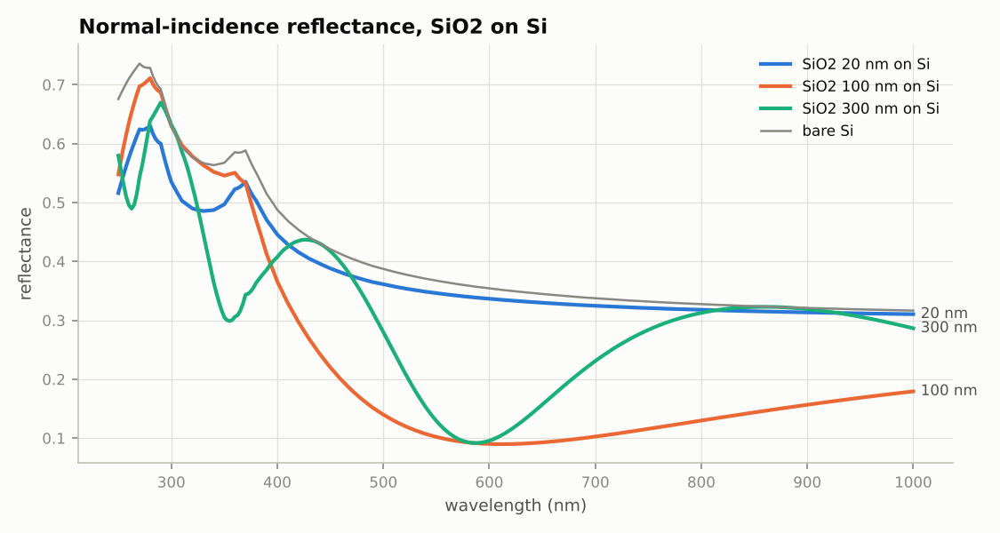
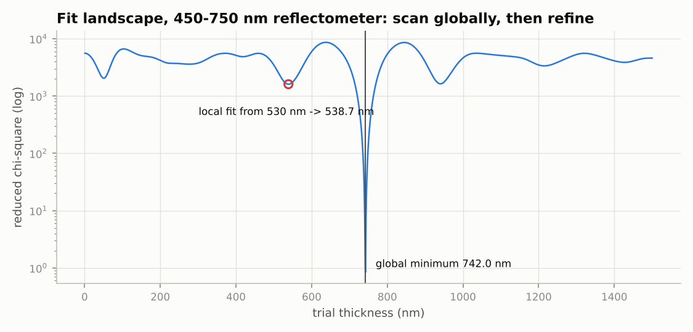
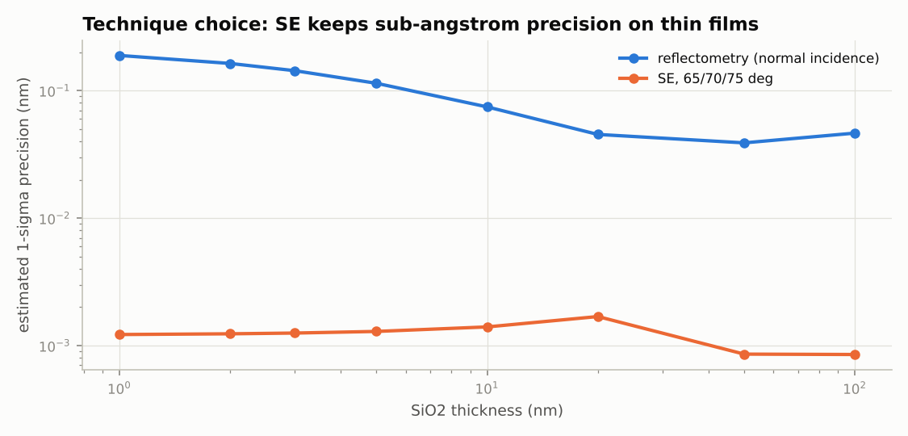
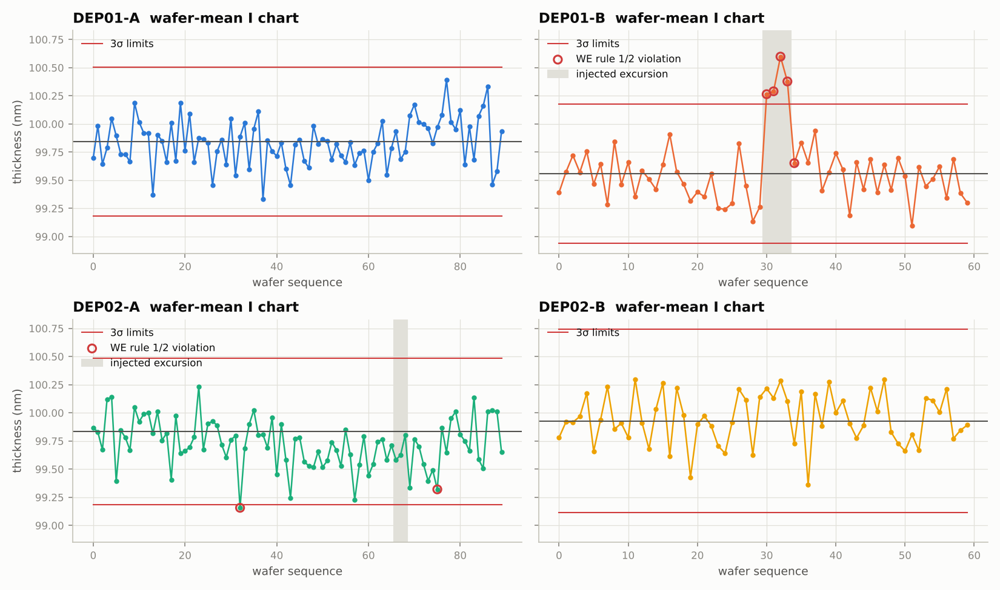
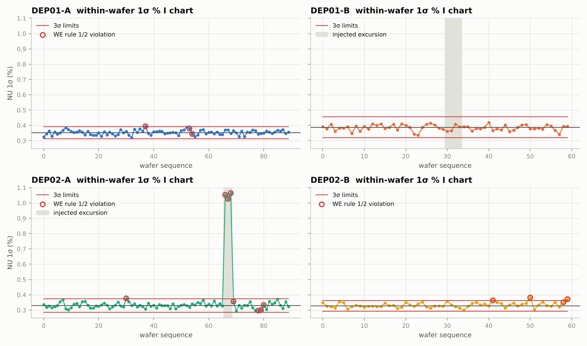
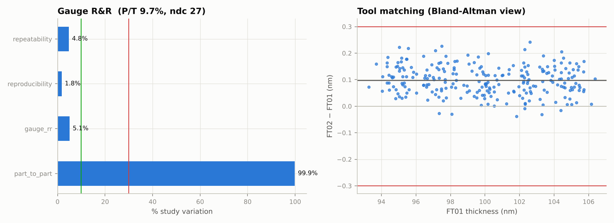

# metro-toolkit thin-film demo report

All data is synthetic. Generated by `python -m metro_toolkit.demo`.

## 1. Optics and fitting

Thick oxide (742 nm) on a narrow-band (450-750 nm) reflectometer: global fit **742.04 ± 0.05 nm** (chi2_red 0.73). A local optimiser started at 530 nm stops at 538.7 nm (chi2_red 1609). More fringes = more traps; the toolkit scans the whole range first. A wide UV-NIR band (250-1000 nm) removes most of them.

## 2. Recipe development studies

**Floating n and thickness together** (single Cauchy film, SE). The thinner the film, the less the data constrains n (A_stderr grows) and the closer |corr(t, n)| gets to 1: fix n for thin films.

| thickness_nm | corr_t_n | t_stderr_nm | A_stderr |
|---|---|---|---|
| 2 | 0.9956 | 0.00832 | 0.004076 |
| 5 | 0.9939 | 0.007471 | 0.001418 |
| 10 | 0.9894 | 0.006218 | 0.000573 |
| 50 | 0.9689 | 0.002408 | 3.848e-05 |
| 200 | 0.9631 | 0.002386 | 1e-05 |

**Underlayer error transfer** (HfO2 floated on a fixed 1.0 nm SiO2 IL). Transfer coefficient **0.74 nm/nm**: most of any IL error lands in the HfO2 result while chi2 stays below 1 (no alarm) and the reported stderr stays tiny. Fit statistics cannot catch model errors; a separate IL pre-measurement can.

| underlayer_error_nm | floated_bias_nm | reported_stderr_nm | chi2_red |
|---|---|---|---|
| -0.3 | -0.2233 | 0.0008141 | 0.7454 |
| -0.15 | -0.1122 | 0.0006604 | 0.4887 |
| 0 | -0.001062 | 0.0005957 | 0.3961 |
| 0.15 | 0.11 | 0.000651 | 0.4713 |
| 0.3 | 0.221 | 0.000805 | 0.7179 |

## 3. Wafer: spectra → thickness map

49 simulated reflectance spectra fitted in 3.0 s (first site global, others seeded). Fit error vs truth: mean +0.001 nm, max |err| 0.080 nm; 0 sites flagged.

| mean | std | range | nu_1sigma_pct | range_pct | half_range_pct |
|---|---|---|---|---|---|
| 99.24 | 0.5177 | 1.564 | 0.5217 | 1.576 | 0.7882 |

Signature: negative **bowl** = thinner edge (centre-to-edge temperature or flow), **tilt_x** = left-right gradient, **edge_roll** = extra roll-off in the outer ring.

## 4. Fab data: SPC by chamber
Synthetic data: 60 lots, 300 measured wafers, 14700 site rows, 2 deposition tools x 2 chambers. Injected: +1.0 nm shift on DEP01-B, -2 nm bowl on DEP02-A.

| chamber | excursion wafers flagged | other rule 1/2 flags |
|---|---|---|
| DEP01-A | 0/0 | 3 |
| DEP01-B | 4/4 | 1 |
| DEP02-A | 3/3 | 7 |
| DEP02-B | 0/0 | 4 |

The bowl excursion barely moves the wafer **mean**; it shows up on the within-wafer 1σ % chart. Always chart both (the table counts flags from either chart):

| chamber_id | mean NU 1σ % | max NU 1σ % |
|---|---|---|
| DEP01-A | 0.354 | 0.3942 |
| DEP01-B | 0.3843 | 0.4191 |
| DEP02-A | 0.3551 | 1.064 |
| DEP02-B | 0.3332 | 0.382 |

| chamber | mean | Cpk | Ppk |
|---|---|---|---|
| DEP01-A | 99.83 | 2.165 | 2.146 |
| DEP01-B | 99.57 | 1.557 | 1.237 |
| DEP02-A | 99.73 | 2.088 | 1.882 |
| DEP02-B | 99.95 | 2.016 | 2.146 |

## 5. Measurement system analysis

| metric | nm | P/T % |
|---|---|---|
| static repeatability 1σ | 0.02729 | 5.457 |
| dynamic repeatability 1σ | 0.0439 | 8.779 |
|   of which load/unload | 0.03379 | nan |
| long-term 1σ (45 d) | 0.04323 | 8.645 |
| GR&R 1σ | 0.04835 | 9.67 |

GR&R verdict: **acceptable** (interaction pooled: True). Stability drift 1.33 pm/day, p = 8.2e-05 (significant: schedule a recalibration check).

| tool | n | mean_offset | sd_difference | deming_slope | offset_equivalent | slope_ok | matched |
|---|---|---|---|---|---|---|---|
| FT02 | 245 | 0.09713 | 0.0544 | 0.9982 | True | True | True |
